# Eclipse GLSP - Project Template:<br> 🖥️ Node ● 🗂️ Custom JSON ● 🖼️ VS Code

This folder contains a simple _project template_ to get you started quickly for your diagram editor implementation based on [GLSP](https://github.com/eclipse-glsp/glsp).
It provides the initial setup of the package architecture and environment for a GLSP diagram editor that uses ...

-   🖥️ The [Node-based GLSP server framework](https://github.com/eclipse-glsp/glsp-server-node)
-   🗂️ A custom JSON format as source model
-   🖼️ The [VS Code integration](https://github.com/eclipse-glsp/glsp-vscode-integration) to make your editor available in VS Code

To explore alternative project templates or learn more about developing GLSP-based diagram editors, please refer to the [Getting Started](https://www.eclipse.org/glsp/documentation/gettingstarted) guide.

## Project structure

This project is structured as follows:

-   [`tasklist-glsp-client`](./tasklist-glsp-client): diagram client configuring the views for rendering and the user interface modules
-   [`tasklist-vscode`](./tasklist-vscode): glue code for integrating the editor into VS Code
    -   [`extension`](./tasklist-vscode/extension): VS Code extension responsible for starting the glsp-server and registering the `webview` as a custom editor
    -   [`webview`](./tasklist-vscode/webview): integration of the `tasklist-glsp` diagram as webview
-   [`workspace`](./workspace): contains an example file that can be opened with this diagram editor
-   [`tasklist-glsp-server`](./tasklist-glsp-server):
    -   [`src/diagram`](./tasklist-glsp-server/src/diagram): dependency injection module of the server and diagram configuration
    -   [`src/handler`](./tasklist-glsp-server/src/handler): handlers for the diagram-specific actions
    -   [`src/model`](./tasklist-glsp-server/src/model): all source model, graphical model and model state related files

The most important entry points are:

-   [`tasklist-glsp-client/src/tasklist-diagram-module.ts`](./tasklist-glsp-client/src/tasklist-diagram-module.ts): dependency injection module of the client
-   [`glsp-client/tasklist-vscode/extension/package.json`](glsp-client/tasklist-vscode/extension/package.json): VS Code extension entry point
-   [`tasklist-glsp-server/src/diagram/tasklist-diagram-module.ts`](./tasklist-glsp-server/src/diagram/tasklist-diagram-module.ts): dependency injection module of the server

## Prerequisites

The following libraries/frameworks need to be installed on your system:

-   [Node.js](https://nodejs.org/en/) `>=20`
-   [Yarn](https://classic.yarnpkg.com/en/docs/install#debian-stable) `>=1.7.0 <2`

## VS Code Extension

For a smooth development experience we recommend a set of useful VS Code extensions. When the workspace is first opened VS Code will ask you wether you want to install those recommended extensions.
Alternatively, you can also open the `Extension View` (Ctrl + Shift + X) and type `@recommended` into the search field to see the list of `Workspace Recommendations`.

## Building the example

To build and bundle all components execute the following in the directory containing this README:

```bash
yarn
```

## Running the example

To start the example open the directory containing this README in VS Code and then navigate to the `Run and Debug` view (Ctrl + Shift + D).
Here you can choose between four different launch configurations:

-   `Launch Tasklist Diagram Extension`: <br>
    This config can be used to launch a second VS Code runtime instance that has the `Tasklist Diagram Extension` installed.
    It will automatically open an example workspace that contains a `example.tasklist` file. Double-click the file in the `Explorer` to open it with the `Tasklist Diagram Editor`.
    This launch config will start the GLSP server as embedded process which means you won't be able to debug the GLSP Server source code.
-   `Launch Tasklist Diagram Extension (External GLSP Server)`<br>
    Similar to the `Launch Tasklist Diagram Extension` but does not start the GLSP server as embedded process.
    It expects that the GLSP Server process is already running and has been started externally with the `Launch Tasklist GLSP Server` config.
-   `Launch Tasklist GLSP Server`<br>
    This config can be used to manually launch the `Tasklist GLSP Server` node process.
    Breakpoints in the source files of the `glsp-server` directory will be picked up.
    In order to use this config, the `Tasklist Diagram Extension` has to be launched in `External` server mode.
-   `Launch Tasklist Diagram extension with external GLSP Server`<br>
    This is a convenience compound config that launches both the `Tasklist Diagram Extension` in external server mode and the
    `Tasklist GLSP server` process.
    Enables debugging of both the `glsp-client` and `glsp-server`code simultaneously.

## Packaging the example

To package the example extension as `*.vsix` execute the following in the directory containing this README:

```bash
yarn package
```

This will create a `tasklist-vscode-*.vsix` file (located in the [extension directory](./tasklist-vscode/extension/)) that can be installed in VS Code.

## Next steps

Once you are up and running with this project template, we recommend to refer to the [Getting Started](https://www.eclipse.org/glsp/documentation) to learn how to

-   ➡️ Add your custom [source model](https://www.eclipse.org/glsp/documentation/sourcemodel) instead of using the example model
-   ➡️ Define the diagram elements to be generated from the source model into the [graphical model](https://www.eclipse.org/glsp/documentation/gmodel)
-   ➡️ Make the diagram look the way you want by adjusting the [diagram rendering and styling](https://www.eclipse.org/glsp/documentation/rendering)

## More information

For more information, please visit the [Eclipse GLSP Umbrella repository](https://github.com/eclipse-glsp/glsp) and the [Eclipse GLSP Website](https://www.eclipse.org/glsp/).
If you have questions, please raise them in the [discussions](https://github.com/eclipse-glsp/glsp/discussions) and have a look at our [communication and support options](https://www.eclipse.org/glsp/contact/).


# Editor de Modelos ER a SQL (en Eclipse-GLSP)

Esta herramienta permite a los desarrolladores diseñar esquemas de bases de datos de forma visual. No es solo un programa de dibujo; incluye un motor de validación para asegurar que el modelo ER sea correcto y una función de transformación que convierte el gráfico en código SQL listo para usar.

## Arquitectura del proyecto

El proyecto se divide en dos componentes principales:

- glsp-client: controla cómo se ven los elementos y la interfaz de usuario.
- glsp-server: contiene la lógica del modelo, las reglas de validación y el generador de SQL.

## Componentes del modelo ER

### Entidades

- Entidad fuerte: elemento principal independiente que representa la existencia de un objeto. 
- 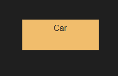
- Entidad débil: depende de una entidad fuerte para existir y debe estar conectada mediante una relación de dependencia.
- 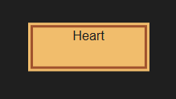

### Atributos

- Atributo simple: descripción básica de una entidad. 

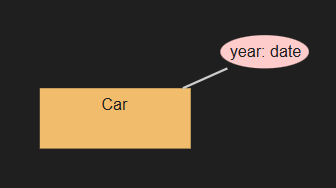

- Clave primaria: identificador único de la entidad. 

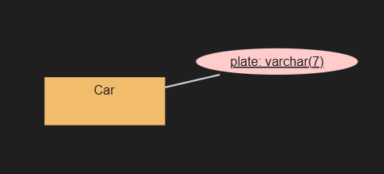

- Clave alternativa: identificadores secundarios únicos. 

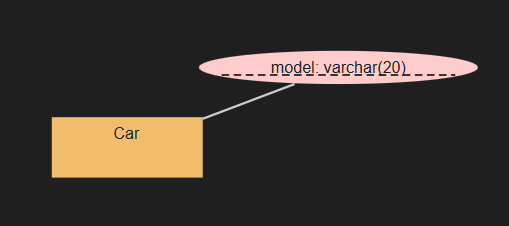

- Atributo compuesto: atributos que están divididos en partes más pequeñas, cada sub-parte tiene su propio significado.

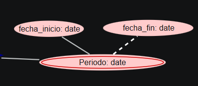

- Atributo opcional: atributos que se transforman a valores nulos en SQL.

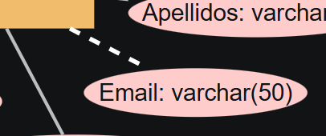

- Atributo derivado: valores que se calculan a partir de otros datos.


- Atributo multivaluado: atributos que pueden tener varios valores a la vez.

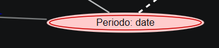

## Relaciones

- Relación: representa una asociación lógica entre dos o más entidades. Se utiliza un rombo conectado mediante líneas con peso.

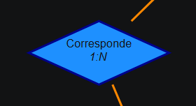

- Dependencia en identificación: la entidad débil no tiene una clave propia que la identifique unívocamente, sino que necesita la clave de la entidad fuerte.

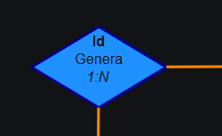

- Dependencia en existencia: se usa cuando una entidad débil no puede existir sin la presencia de otra fuerte.

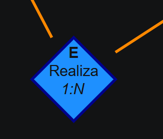

## Especializaciones (Jerarquías)

Las especializaciones permiten definir jerarquías donde una entidad "Superclase" se divide en varias "Subclases" que heredan sus atributos.

- Parcial-Exclusiva: una entidad padre puede no pertenecer a ninguna subclase, y si pertenece a una, solo puede ser a una.

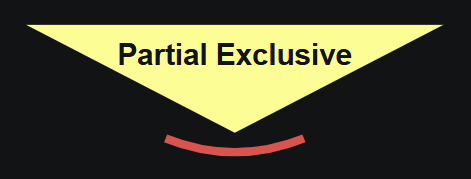

- Parcial-solapada: el padre puede no ser de ninguna subclase, o ser de varias simultáneamente. 

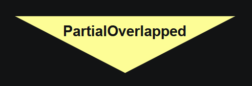

- Total-Exclusiva: el padre debe pertenecer obligatoriamente a una subclase, y solo a una.


- Total-Solapada: el padre debe ser al menos de una subclase, pudiendo ser de varias.

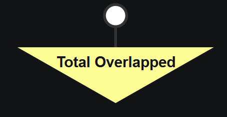


## Validación del modelo ER

### Entidades

Entidad fuerte:

- Tiene que estar conectada a algo.
- Tiene que tener una clave primaria.
- Solo puede estar conectada a relaciones o dependencias mediante aristas de cardinalidad.

Entidad débil:

- Tiene que estar conectada a algo.
- Tiene que estar conectada a una relación o dependencia mediante aristas ponderadas.
- Conexiones a dependencias:
    - Dependencia en existencia: tiene que tener una clave primaria.
    - Dependencia en identificación: no puede tener clave primaria.
- Conexiones a especializaciones:
    - No puede ser una subclase de una especialización.
    - Tiene que estar conectada mediante transiciones.
- Conexiones a atributos:
    - Tiene que estar conectada mediante transiciones normales u opcionales.

### Atributos

Clave primaria:

- Tiene que estar conectada a algo.
- Solo puede estar conectada mediante transiciones.
- No puede estar conectada a dependencias, especializaciones ni el resto de atributos.
- No pueden tener hijos, solo transiciones de entrada.

Clave alternativa:

- Tiene que estar conectada a algo.
- Solo puede estar conectada a transiciones normales u opcionales.
- No puede estar conectada a especializaciones.
- No se puede conectar a atributos que no sean del mismo tipo.

Atributo normal:

- Tiene que estar conectada a algo.
- Solo puede estar conectada a transiciones normales u opcionales.
- No puede estar conectada a especializaciones.
- No se puede conectar a atributos que no sean del mismo tipo.

Atributo multivaluado:

- Tiene que estar conectada a algo.
- Solo puede estar conectada a transiciones normales u opcionales.
- No puede estar conectada a especializaciones o dependencias.
- No se puede conectar a atributos que no sean del mismo tipo.

Atributo derivado:

- Tiene que estar conectada a algo.
- Solo puede estar conectada a transiciones normales u opcionales.
- No puede estar conectada a especializaciones.
- No pueden tener hijos.

### Relaciones

Relación:

- Tiene que estar conectada a algo.

Dependencia en identificación:

- Tiene que estar conectada a algo.
- No pueden estar conectadas con otras relaciones o dependencias.
- Tienen que estar conectadas a una entidad fuerte o débil mediante aristas ponderadas.
- La cardinalidad de las dependencias en identificación no puede ser N..M o 1..1

Dependencia en existencia:

- Tiene que estar conectada a algo.
- No pueden estar conectadas con otras relaciones o dependencias.
- Tienen que estar conectadas a una entidad fuerte o débil mediante aristas ponderadas.

### Especializaciones

Especialización (para los 4 tipos):

- Tiene que estar conectada a algo.
- No admite ni aristas ponderadas ni opcionales.
- Las aristas de salida tienen que ser como mínimo hacía dos entidades.
- Solo admite una arista de entrada de una entidad.


## Transformación del modelo ER a SQL

En este proceso se lee el diagrama visual y se traduce a un script SQL. Este proceso lo coordina la clase SQLGenerator, que utiliza estructuras de datos y transformadores especializados para cada componente.

### sql-interfaces.ts

Define el esquema que organiza la información del modelo.

- Interfaz del atributo multivaluado 

``` typescript
export interface Multivalued {
    name: string,                   // Nombre del atirbuto multivaluado
    parentName: string,             // Nombre de la entidad del atributo
    parentPKs: { node: GNode, tableName: string, colName: string }[],   
    // array de un objeto que contiene el nodo de la PK de la entidad a la que pertenece, el nombre de la tabla a la que pertenece y el nombre de la PK
    selfNode: GNode[]               // array de nodos por si el mutlivaluado es compuesto
}
```

- Interfaz de los atributos del modelo e/r

``` typescript
export interface AllAttributes {
    pk: GNode[];                    // Array de nodos de PK
    unique: { isNullable: boolean, nodes: GNode[] }[];  
    // Array de objetos que contiene si el atributo es nulo y el propio nodo
    simple: GNode[];                // Array de nodos simples
    optional: GNode[];              // Array de nodos opcionales
    multiValued: Multivalued[];     // Array de atributos multivaluados
    derived?: GNode[];              // Array de nodos derivados
}
```

- Interfaz de las entidades del modelo e/r

``` typescript
export interface Entity {
    name: string,                   // Nombre
    node: GNode,                    // Nodo
    type: string,                   // Tipo
    attributes: AllAttributes       // Atributos de la entidad
}
```

- Interfaz de las relacionales del modelo e/r

``` typescript
export interface Relation {
    name: string,                   // Nombre
    node: GNode,                    // Nodo
    type: string,                   // Tipo
    cardinality: string,            // Cardinalidad
    isReflexive: boolean,           // Es reflexiva
    connectedEntities: { cardinalityText: string, entity: GNode }[],
    // Array que objetos que contiene la cardinalidad de la arista y el nodo al que está conectada
    attributes: AllAttributes,      // Atributos de la relación
}
```

- Interfaz para construir multivaluados en relaciones N:M

``` typescript

// es un mapeo auxiliar que vincula un nodo con el nombre de su columna y la tabla a la que pertenece

export interface PKMapping {
    node: GNode, 
    tableName: string, 
    colName: string
}
```

- Interfaz para las especializaciones del modelo e/r

``` typescript
export interface Specialization {
    node: GNode,                // Nodo
    type: string,               // Tipo
    father: Entity,             // Entidad padre
    children: Entity[],         // Array de entidades hijas
    enum: string,               // Enum
    discriminator: string       // Discriminador
}
```

- Interfaz para todas las tablas que se generan del modelo e/r

``` typescript
export interface GeneratedTable {
    name: string;                   // Nombre de la tabla
    sql: string;                    // Código SQL
    dependencies: string[];         // Tablas de las que depende
}
```

Mapas que guardan entidades, relaciones y especializaciones con su respectivo ID e interfaz.
``` typescript
export type EntityNodes = Map<string, Entity>;
export type RelationNodes = Map<string, Relation>;
export type SpecializationNodes = Map<string, Specialization>;
```

### sql-generator.ts

- Función `generate()`: Limpia los mapas, recorre todos los hijos del modelo y los clasifica en entidades, relaciones y especializaciones. Llama a los transformadores para recopilar la información de cada nodo y almacenarla en los mapas. Luego itera sobre entidades y relaciones N:M/ternarias para generar las `GeneratedTable`. Finalmente llama a sortTables y devuelve el SQL completo.

- Función `sortTable()`: ordena las tablas generadas respetando las dependencias de claves foráneas (una tabla no puede crearse antes que la tabla a la que referencia). Usa un bucle que en cada vuelta saca las tablas cuyas dependencias ya han sido creadas. Si detecta un ciclo (el array no decrece), fuerza la salida de la primera tabla restante para evitar un bucle infinito.

### sql-attributes-transformer.ts

- Función `processPK()`: convierte un array de nodos PK en columnas SQL. Si hay una sola PK, la pone en la columna como `NOT NULL PRIMARY KEY`. Si hay varias, genera cada columna por separado y añade una restricción `PRIMARY KEY (col1, col2, ...)` al final.

- Función `processUnique()`: hace lo mismo para claves alternativas. Si el grupo tiene un solo atributo, añade `UNIQUE` en línea. Si son varios, genera las columnas sin `UNIQUE` y añade una restricción `UNIQUE (col1, col2)`.

- Función `processSimpleAttributes()`: recorre los atributos simples y genera `nombre TIPO NOT NULL` para cada uno.

- Función `processOptionalAttributes()`: igual que el anterior pero con `NULL`, ya que son opcionales.

- Función `processMultivaluedAttributes()`: para cada atributo multivaluado crea una tabla nueva cuyo nombre es `entidadPadre_atributo`. Construye una PK compuesta de las PKs del padre más el propio atributo multivaluado. Luego genera la FK hacia el padre con ON DELETE CASCADE. El tratamiento de la FK varía según si el padre es una relación identificativa (usa las columnas agrupadas), una relación N:M reflexiva (elimina los sufijos _1/_2 al referenciar) o en un caso normal se ponen directamente las FK.

- Función `transformPKs()`: busca todas las aristas `default-edge` que salen de la entidad y devuelve los nodos de destino que sean de tipo `KEY_ATTRIBUTE`.

- Función `transformUnique()`: busca aristas `default-edge` u `optional-edge` que lleguen a nodos `ALTERNATIVE_KEY_ATTRIBUTE`. Si ese nodo tiene hijos (unique compuesto), los recoge todos; si no, lo trata como único.

- Función `transformSimple()`: busca aristas que no sean opcionales y cuyos destinos sean `ATTRIBUTE_TYPE`. Si el atributo es compuesto (tiene hijos), devuelve los hijos; si no, devuelve el nodo directamente.

- Función `transformOptionals()`: igual que `transformSimple` pero filtrando solo las aristas `optional-edge`.

- Función `transformMultivalued()`: detecta atributos `MULTI_VALUED_ATTRIBUTE_TYPE` conectados al nodo y construye el objeto `Multivalued`. La lógica para obtener `parentPKs` varía bastante según el tipo del padre: si es entidad fuerte usa sus PKs directamente; si es relación N:M sin PKs propias sube a las entidades conectadas; si es 1:N localiza la entidad del lado N; si es 1:1 elige la entidad no opcional (o la de menor ID como desempate).

- Función `getCompositeNodes()`: devuelve los nodos hoja de un atributo: si tiene aristas salientes (compuesto) devuelve los destinos; si no, devuelve el propio nodo en un array.

- Función `getAllAtributes()`: gestiona la recopilación completa de atributos de un nodo. Llama a los cuatro `transform` en orden y usa un `Set de IDs` procesados para evitar que un atributo aparezca duplicado en varias categorías.

### sql-entities-transformer.ts